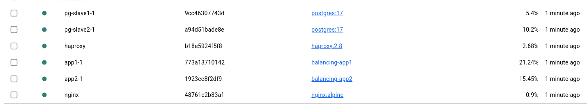
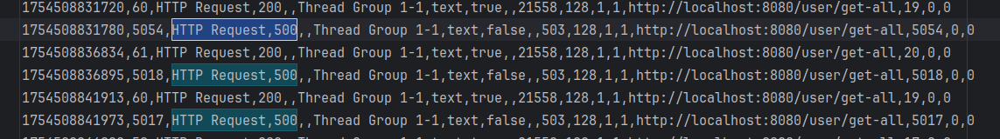

# Балансировка

## Изменения в проекте
 
Создан [docker-compose.yml](./docker-compose.yml) файл, в котором применена следующая конфигурация:
- pg-slave1 и pg-slave2 контейнеры с Postgres, которые поднимаются на бэкапе БД с готовой схемой и зарегистрированными пользователями
- HAProxy прослушивает 5432 для всех интерфейсов и проксирует на 5432 pg-slave контейнеров
- app1 и app2 контейнеры с приложением на портах 8888 и 8889
- nginx проксирует внешний порт 8080 на 80 внутрь контейнера и затем на app1 или app2

## Проведение эксперимента

1. Поднимаем все контейнеры

```shell
docker compose up --build
```

2. Настраиваем внешний Jmeter для выполнения запроса на http://localhost:8080/user/get-all, который затем идёт в nginx
3. Начинаем бесконечно выполнять запросы в 1 поток и удостоверяемся, что приходит 200 статус и все контейнеры расходуют ЦП


4. Останавливаем один из слэйвов
```shell
docker compose rm --stop --force pg-slave1
```

5. Видим, что 3 запроса завершается с 500 статусом (которые работали в момент завершения), но остальные по-прежнему возвращают 200



6. Останавливаем контейнер с одним из приложений
```shell
docker compose rm --stop --force app1
```
7. Видим, что все запросы выполняются корректно

Таким образом, система переживает остановку процесса БД и Load Balancer работают корректно. Проблемы с некоторыми запросами
объясняются тем, что health-check работают не так часто и балансер ещё не исключил сервер из балансировки. 

