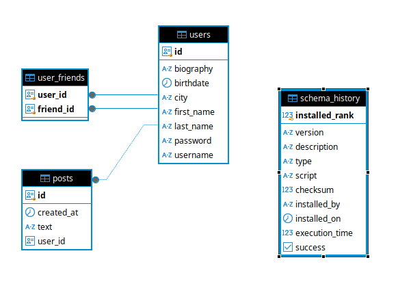

# Кэширование ленты новостей

## Изменения в проекте
### Добавлены новые REST-методы


Для части из этих методов **POST /post/create** и **GET /post/feed** и для всех REST работы с друзьями требуется Bearer-Token пользователя, под которым будут
осуществляться действия , поскольку посты / друзья и лента друзей привязаны к этому пользователю.

Чтобы получить этот токен, необходимо выполнить **POST /login** и вставить токен на страницы Swagger:


### Изменена схема БД



### Добавлено кэширование постов в Caffeine

В [CacheConfig.java](../src/main/java/com/example/myapp/config/CacheConfig.java) конфигурируется кэш постов на 1000 записей,
которые инвалидируются по времени (последняя запись в кэша была час назад), инвалидация происходит при работе с кэшем (отдельного потока-инвалидатора нет).

Сам механизм кэширования поддерживается Spring через аннотации **@Cacheable** и применяется в сервисе
[PostService.java](../src/main/java/com/example/myapp/service/PostService.java)

### Написан python-скрипт наполнения БД данными gen_data.py
Добавляются записи о трёх пользователях, для первого пользователя второй и третий становятся друзьями и каждый из друзей публикует
2к постов

## Проверка работоспособности и анализ результатов

Для проверки работы кэша выполнял тестовый запрос в Jmeter на получение ленты новостей следующим образом:
- запрос выполнялся раз в 2 секунды
- параметр offset был всегда 0, а limit каждый новый запрос увеличивался на 100
- в параметрах кэша выставил инвалидацию по последней записи через 30 секунд


На дашборде графана представлены основные метрики кэша, доступные в Actuator-Prometheus
Видим, что в течение времени cache_size держится на стабильном уровне 1000 запросов, в то время как срабатывает инвалидация старых записей
и идёт активная работа с кэшем. После окончания теста и выполнения одного запроса на получение поста, весь кэш был инвалидирован.

Всё работает корректно.

## Развёртывание приложения

```shell
docker compose -f docker-compose-app.yaml down
docker compose -f docker-compose-app.yaml up --build
```
Приложение будет поднято на бэкапе с заполенными таблицами. Доступ в swagger: http://localhost:8888/swagger-ui/index.html


