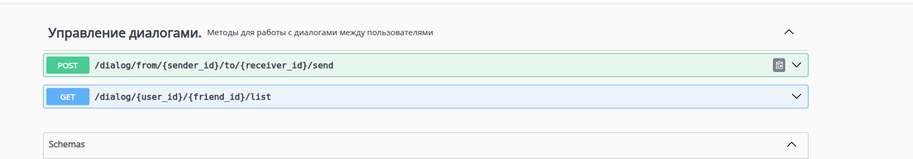
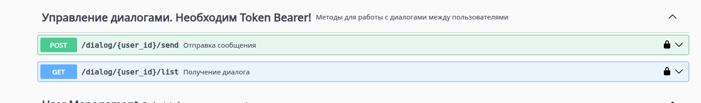

# Разделение монолита на микросервисы

## Изменения в проекте

### Добавлен новый проект микросервиса для работы с диалогами

Микросервис представляет из себя отдельное Spring-Boot приложение, которое подключается к своей БД (где находится только одна таблица messages).
Исходные файлы находятся по пути [micro/src/main/java](src/main/java). Сервис объявляет RestController с 2мя методами:



При этом на стороне основного приложения методы остались неизменными:



Однако изменена их логика работы: теперь через синхронный RestTemplate запрос отправляется в микросервис, а не напрямую в БД.

При этом авторизация есть только со стороны основного приложения: из SecurityContext определяется Principal и затем в микросервис отправляются
только параметры с UUID пользователей. Также из основного приложения выпилен функционал, относящийся к диалогам (сервисные классы, dao).

### Реализовано сквозное логирование

На стороне основного приложения в конфигурацию RestTemplate доавблен интерцептор RequestIdInterceptor
[RestTemplateConfig](../src/main/java/com/example/myapp/config/RestTemplateConfig.java), который генерирует
для запроса x-request-id, добавляет его в хэдэр и MDC и выполняет логирование зпроса.

Так выглядит запись в лог:
`2025-08-07T10:00:01.064+03:00  INFO 34385 --- [nio-8888-exec-5] c.e.myapp.config.RequestIdInterceptor    : Outgoing request: POST http://localhost:8889/dialog/from/cb45b202-c2c1-4790-8de7-756b3e1ae2ee/to/cb45b202-c2c1-4790-8de7-756b3e1ae2ee/send with body: "string" and requestId: 1a5c6c66-b1ff-4da8-95a8-065c73903f80`

На стороне микросервиса добавлен фильтр [RequestIdFilter](src/main/java/com/example/myapp/filters/RequestIdFilter.java), который
проставляет значение из хэдэра в MDC и затем запрос логируется в другом фильтре. Так выглядит информация о пришедшем запросе:

`Incoming request uri /dialog/from/cb45b202-c2c1-4790-8de7-756b3e1ae2ee/to/cb45b202-c2c1-4790-8de7-756b3e1ae2ee/send id: 1a5c6c66-b1ff-4da8-95a8-065c73903f80`


## Как запустить 

Подготовил `general-docker-compose.yml`, который развернёт основное приложение + БД основного приложения,
микросервис + БД для микросервиса

```shell
docker compose -f general-docker-compose.yml down
docker compose -f general-docker-compose.yml up --build
```

Доступ в Swagger-ui доступен по адресам
- основное приложение: http://localhost:8888/swagger-ui.html
- микросервис: http://localhost:8889/swagger-ui.html
