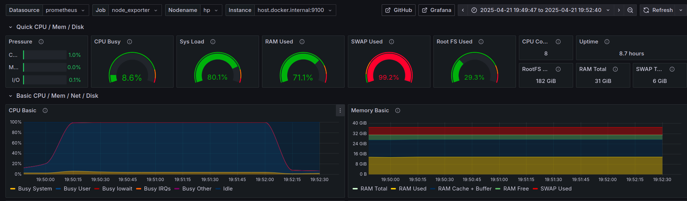

# Репликация Postgres 

## Изменения в проекте
### Реализована возможность в завиисмости от типа транзакции выбирать конкретный DataSource
В качестве источника данных использована реализация [AbstractRoutingDataSource](https://docs.spring.io/spring-framework/docs/current/javadoc-api/org/springframework/jdbc/datasource/lookup/AbstractRoutingDataSource.html), конфигурация которой представлена в [DataSourceConfig.java](../src/main/java/com/example/myapp/config/DataSourceConfig.java)
При выполнении транзакции в контексте сохраняется транзакция READ или WRITE, а в [TransactionRoutingDataSourceType.java](../src/main/java/com/example/myapp/config/TransactionRoutingDataSource.java) в случае READ траназкции
выбирается рандомный DataSource из READ-ONLY.

В конфигурационном файле приложения **application.yaml** есть настройка
- `spring.datasource.read-only` (необязательный параметр) - массив датасорсов, который будет использоваться только в READ транзакциях
- `spring.datasource.read-write` (обязательный параметр) - датасорс, который используется только для WRITE транзакций (если определен read-only параметр) и для READ/WRITE в противном случае


```yaml
spring:
  datasource: 
    # необязательные датасорсы для READ
    read-only:
    - url: jdbc:postgresql://localhost:6531/mydatabase
      username: ${SPRING_READ_ONLY_DATASOURCE_USERNAME:postgres}
      password: ${SPRING_READ_ONLY_DATASOURCE_PASSWORD:postgres}
      driverClassName: org.postgresql.Driver
    - url: jdbc:postgresql://localhost:6532/mydatabase
      username: ${SPRING_READ_ONLY_DATASOURCE_USERNAME:postgres}
      password: ${SPRING_READ_ONLY_DATASOURCE_PASSWORD:postgres}
      driverClassName: org.postgresql.Driver

    # обязательный датасорс для WRITE
    read-write:
      url: ${SPRING_DATASOURCE_URL:jdbc:postgresql://localhost:6530/mydatabase}
      username: ${SPRING_DATASOURCE_USERNAME:postgres}
      password: ${SPRING_DATASOURCE_PASSWORD:postgres}
      driver-class-name: org.postgresql.Driver
```

**Для проверки работы такого механизма можно:**

1. Запустить, используя docker-compose 3 сервиса: 
  - app - само приложение
  - postgres-read - инстанс БД Postgres, который указан как read-only датасорс в параметрах приложения; при этом используется [скрипт инициализации init-read.sql](./db/init-read.sql)
  - postgres-write - инстанс БД Postgres, который указан как read-write датасорс в параметрах приложения; при этом используется [скрипт инициализации init-write.sql](./db/init-write.sql)
```shell
docker compose -f app-docker-compose.yaml down -v
docker compose -f app-docker-compose.yaml up --build
```

После успешного старта в логах my_app сервиса будут строчки иницилазции источников:
>  Use read-only datasource: jdbc:postgresql://postgres-read:5432/mydatabase 
> 
> Use write datasource: jdbc:postgresql://postgres-write:5432/mydatabase

2. Получить всех пользователей, выполнив REST http://localhost:8888/swagger-ui/index.html#/User%20Management/getAllUsers и убедиться, 
что отсутствуют пользователь с именем "Вацлав Авдеевич", который был добавлен в таблицу users postgres-write скриптом инициализации
[скрипт инициализации init-write.sql](./db/init-write.sql) на инстансе postgres-write. Значит приложение читает с postgres-read.

Кроме того, в логах будет запись:
> Use key=READ_ONLY0 for transaction

что означает, что запрос выполнялся на read-only датасорсе.

3. Зарегистрировать нового пользователя, выполнив http://localhost:8888/swagger-ui/index.html#/User%20Management/registerUser и получив user_id (WRITE-транзакция). Затем выполнить /user/login (READ-транзакция) и убедиться,
что возвращается ответ 404 (пользователя нет на postgres-read, т.к. он на postgres-write).

### Добавлен REST /system/get-exception-count
Для выполнения второй части задания необходимо считать кол-во ошибочных транзакций на стороне приложения. Добавил REST, который через аспекты инкрементирует счётчик исключений, которые могут возникнуть во время выполнения REST-методов.

---

## Выполнение задания

### Профиль нагрузочного и ПО
Для проведения нагрузочного тестирования решил использовать JMeter

Мониторинг докер-контейнеров производился через **Cadvisor** (CPU, Memory); хоста - **Node Exporter** (CPU/Memory),
   приложения - **JMeter + InfluxDb2** (Latency / Throughput / ErrCount). Визуализация в **Grafana**.


**Асинхронная репликация на slave-ы:**
- запрос чтения на `/user/search` для нахождения пользователей по префиксу и постфиксу, которые генерировались groovy-скриптом


- запрос чтения на `/user/get/${user-id}` для получения конкретного юзера по id, который брали из предыдущего запроса (первый пользователь)
- кол-во потоков 100 шт
- продолжительность 2 минуты

**Синхронная кворумная репликция:**
- запрос записи на `/user/register` с телом 
```text
{
  "username": "r${__RandomString(10,abcdefghijklmnopqrstuvwxyz0123456789)}",
  "firstName": "ivan",
  "lastName": "ivanov",
  "birthdate": "1990-01-01",
  "biography": "love programming",
  "city": "Moscow",
  "password": "securepassword123"
}
```
- кол-во потоков 5 шт
- продолжительность 1 минута
### Нагрузочное без репликации Postgres

Приложение было поднято на 1 DataSource Postgres (read-write датасорс) и было произведено наполнение БД записями о 500к пользователей через [этот баш скрипт](../stress_testing/generate_users.sh). Проведено нагрузочное.

### Нагрузочное на 2 slave и 1 master

1. Создаем сеть, запоминаем адрес
    ```shell
    docker network create pgnet
    docker network inspect pgnet | grep Subnet # Запомнить маску сети (у меня 172.21.0.0/16)
    ```

2. Поднимаем мастер (БД mydatabase, user=postgres, password=postgres)
    ```shell
    docker run -dit -v "$PWD/volumes/pgmaster/:/var/lib/postgresql/data" -e POSTGRES_PASSWORD=postgres -e POSTGRES_DB=mydatabase -p "6530:5432" --restart=unless-stopped --network=pgnet --name=pgmaster postgres
    ```

3. Меняем postgresql.conf на мастере через смонтированный volume
    ```conf
    ssl = off
    wal_level = replica
    max_wal_senders = 4 # expected slave num
    ```
4. Подключаемся к мастеру и создаем пользователя для репликации
    ```shell
    docker exec -it pgmaster su - postgres -c psql
    create role replicator with login replication password 'pass';
    exit
    `
5. Добавляем запись в `pgmaster/pg_hba.conf` с `subnet` (__SUBNET__ заменяем значением из 1-го шага)
    ```
    host    replication     replicator       __SUBNET__          md5
    ```

6. Перезапустим мастер
    ```shell
    docker restart pgmaster
    ```

7. Поднимаем приложение с одним read-write датасорсом мастера для инициализации схемы БД и после старта приложения - останавливаем его
8. Выполняем [скрипт](../stress_testing/generate_users.sh) для наполнения таблицы users пользователями (500к)
9. Сделаем бэкап для реплик внутри контейнера pgmaster
    ```shell
    docker exec -it pgmaster bash
    mkdir /pgslave
    pg_basebackup -h pgmaster -D /pgslave -U replicator -v -P --wal-method=stream
    exit
    ```
10. Копируем директорию /pgslave себе из контейнера
    ```shell
    docker cp pgmaster:/pgslave volumes/pgslave1/
    ```
11. Создадим файл, чтобы реплика pgslave1 узнала, что она реплика
    ```shell
    touch volumes/pgslave1/standby.signal
    ```
12. Меняем `postgresql.conf` на реплике `pgslave1`
    ```conf
    primary_conninfo = 'host=pgmaster port=5432 user=replicator password=pass application_name=pgslave1'
    ```
13. Запускаем реплику `pgslave1`
    ```shell
    docker run -dit -v "$PWD/volumes/pgslave1/:/var/lib/postgresql/data" -e POSTGRES_PASSWORD=postgres -p "6531:5432" --network=pgnet --restart=unless-stopped --name=pgslave1 postgres
    ```
14. Запустим вторую реплику `pgslave2`
    - скопируем бэкап
        ```shell
        docker cp pgmaster:/pgslave volumes/pgslave2/
        ```

    - изменим настройки `pgslave2/postgresql.conf`
        ```conf
        primary_conninfo = 'host=pgmaster port=5432 user=replicator password=pass application_name=pgslave2'
        ```

    - дадим знать что это реплика
        ```shell
        touch volumes/pgslave2/standby.signal
        ```

    - запустим реплику `pgslave2`
        ```shell
        docker run -dit -v "$PWD/volumes/pgslave2/:/var/lib/postgresql/data" -e POSTGRES_PASSWORD=pass -p "6532:5432" --network=pgnet --restart=unless-stopped --name=pgslave2 postgres
        ```
15. На мастере выполняем и убеждаемся, что обе реплики pgslave1 и pgslave2 работают в режиме асинхронной репликации
```shell
docker exec -it pgmaster su - postgres -c psql
select application_name, sync_state from pg_stat_replication;
```


16. Поднимаем приложение на read-only датасорсах (слэйвы) и 1 мастере (read-write).
17. Проводим нагрузочное

### Нагрузочное при синхронной кворумной репликации (кворум из 1 slave-реплики)
18. Включаем синхронную репликацию на `pgmaster`
    - меняем файл `pgmaster/postgresql.conf`
        ```conf
        synchronous_commit = on
        synchronous_standby_names = 'FIRST 1 (pgslave1, pgslave2)
        ```

    - перечитываем конфиг
        ```shell
        docker exec -it pgmaster su - postgres -c psql
        select pg_reload_conf();
        exit;
        ```
17. Выполняем на pgmaster проверку, что одна из реплик - синхронная, а другая - в режиме готовности стать синхронной:
```shell
    docker exec -it pgmaster su - postgres -c psql
    select application_name, sync_state from pg_stat_replication;
    exit;
```


20. Задаём только один write-датасорс, настроенный на pgmaster
21. Проводим нагрузочное в течение 30 секунд
22. Останавливаем контейнер с pgslave1
23. Останавливаем нагрузочное через 30 секунд
24. Останавливаем контейнер с pgmaster и промоутим pgslave2 до мастера:
```shell
    docker exec -it pgslave2 su - postgres -c psql
    select pg_promote();
    exit;
```

25. Настраиваем репликацию на `pgslave2` (`pgslave2/postgresql.conf`)
    - изменяем конфиг
        ```conf
        synchronous_commit = on
        synchronous_standby_names = 'ANY 1 (pgmaster, pgslave1)'
        ```
    - перечитываем конфиг
        ```shell
        docker exec -it pgslave2 su - postgres -c psql
        select pg_reload_conf();
        exit;
        ```
26. Подключим реплику `pgslave1` к новому мастеру `pgslave2`
    - изменяем конфиг `pgslave1/postgresql.conf`
        ```conf
        primary_conninfo = 'host=pgslave2 port=5432 user=replicator password=pass application_name=pgslave1'
        ```
    - перечитываем конфиг
        ```shell
        docker exec -it pgslave1 su - postgres -c psql
        select pg_reload_conf();
        exit;
        ```
27. Вызываем REST /system/get-exception-count, проверяя потери транзакций
28. Проверяем, что кол-во записей на pgslave1 и pgslave2 совпадают 

## Анализ результатов
### Репликация 2 slave 1 master и нагрузка на чтение

Для удобства сравнения привожу скриншоты метрик до репликации - выше, и после - ниже
- метрики приложения


- метрики контейнеров
  
  

- метрики хоста
  
  

Видно, что как до, так и после репликации основная проблема при подобном профиле тестирования - нехватка ресурсов ЦП. Причём все ресурсы 8 ядер расходуются на БД.
До репликации 8 ядер потреблял контейнер **postgres_container**, после - 2 контейнера **pgslave1** и **pgslave2** в равных долях по 4 ядра. Поскольку проблема в этом,
репликация в данном случае не принесла большИх результатов, лишь незначительно снизив задержку при выполнении запроса на GET пользователей с 1 секунды до 500мс.
Все остальные значения Throughput остались примерно прежними.

Задание выполнено, поскольку видно, что нагрузка перешла на slave.

### Кворумная репликация и нагрузка на запись

Для удобства сравнения привожу скриншоты метрик до репликации - выше, и после - ниже
- метрики приложения


- метрики контейнеров
  

- метрики хоста
  
- вызов REST на подсчёт ошибочных транзакций после нагрузочного
  

Видно, что основную нагрузку на ЦП забирало приложение, а не БД при регистрации пользователей (вычислялся хэш). Отключение основного slave1,
который участвовал в кворуме, произошло в 01:30:27, что отчётливо видно на графиках **Throughput** и **Latency** (есть просадка на секунду, пока шло переключение на 
slave2). При этом ни один из запросов не отвалился, что видно на графике с ErrCount. Также это показал вызов REST-метода приложения - ни одна из транзакций
не завершилась с ошибкой. Т.о. кворумная репликация настроена корректно.
