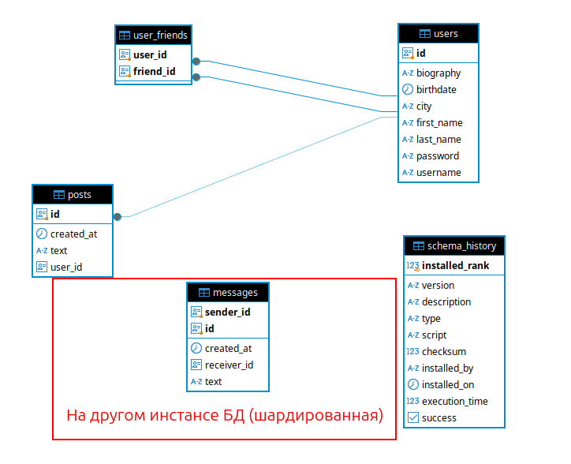
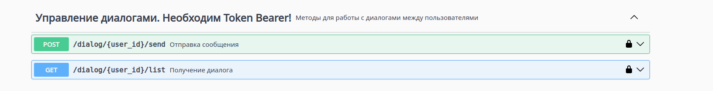
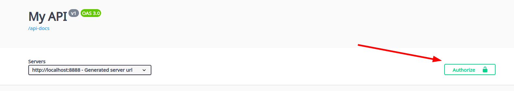
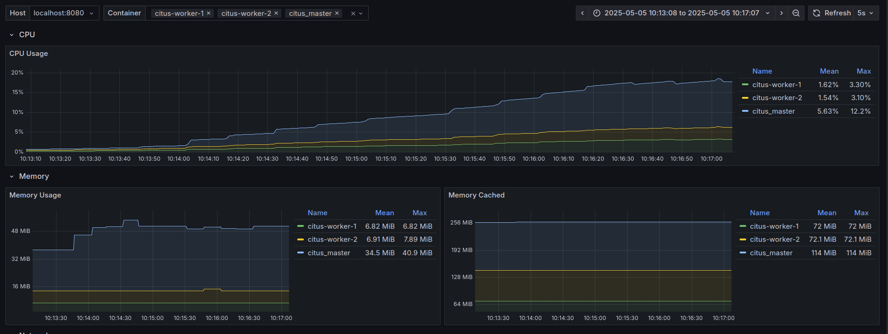
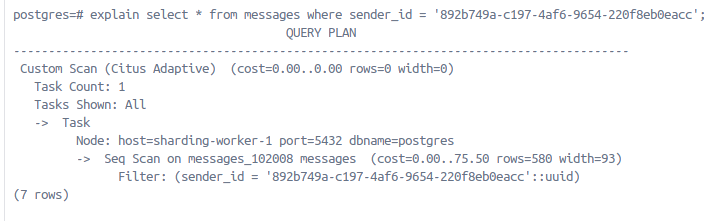

# Шардирование

## Изменения в проекте
### Добавление нового DataSource шардирования
В качестве источника данных в проекте использована реализация [AbstractRoutingDataSource](https://docs.spring.io/spring-framework/docs/current/javadoc-api/org/springframework/jdbc/datasource/lookup/AbstractRoutingDataSource.html), конфигурация которой представлена в [DataSourceConfig.java](../src/main/java/com/example/myapp/config/DataSourceConfig.java)
Добавлен новый источник шардирования, который конфигурируется в  [application.yaml](../src/main/resources/application.yaml):

```shell
spring:
  datasource:
    # необязательный датасорс (если указан - на нём будут выполняться запросы на работу с диалогами)
    sharding:
      url: ${SPRING_SHARDING_DATASOURCE_URL:jdbc:postgresql://localhost:6530/postgres}
      username: ${SPRING_SHARDING_DATASOURCE_USERNAME:postgres}
      password: ${SPRING_SHARDING_DATASOURCE_PASSWORD:postgres}
      driver-class-name: org.postgresql.Driver
```

Он используется только при работе с REST-методами диалогов

### Изменение схемы БД



Здесь "Диалог" представляется как коллекция сообщений от одного пользователя к другому. В роли PK выступает составной ключ на 2 столбца:
**sender_id** и **id** сообщения, поскольку в качестве столбца шардирования выбран **sender_id**. Это сделано затем, чтобы
на запрос поиска диалогов просматривать только один шард, а не искать среди всех, т.к. запрос включает в себя фильтрацию
по **sender_id** и **receiver_id**. 

Также возможно горизонтальное масштабирование в случае добавления диалогов. 

### Добавление новых REST-методов



Работа с этими методами происходит под конкретным пользователем, поэтому для работы необходимо сперва залогиниться:
выполнить **POST /login** и вставить токен результата на страницу Swagger:



## Проведение эксперимента
 
- Настраиваем маппинг портов в [.env](./.env) (основная БД, citus master-БД и приложение) из докера на хост
- Поднимаем citus: несколько worker-ов, master, manager
- Поднимаем наше приложение и основную БД

Всё это делается одной командой: 

```shell
docker compose -f docker-compose-app.yaml down -v
docker compose -f docker-compose-app.yaml up --scale worker=2 -d
```
Доступ в swagger: http://localhost:8888/swagger-ui/index.html

- Настраиваем шардинг на citus_master: создаём таблицу и делаем её распределённой
```shell
docker exec -i sharding_master psql -U postgres <  init.sql
```
- Добавляем данные из скрипта генерации в основную БД и БД citus для всех основных таблиц скриптом [gen_data.py](./gen_data.py) после того,
как удостоверились по логам myapp сервиса, что приложение поднялось
- Меняем wal_level на мастере и репликах, перезапускаем контейнеры:
```SQL 
alter system set wal_level = 'logical';
select run_command_on_workers('alter system set wal_level = logical');
```
- Проводим нагрузочное тестирование в Jmeter SELECT запросов (аналогично INSERT)

### Проведение нагрузочного тестирования

В Jmeter сделал следующий профиль нагрузки:

- посылаем запросы в 100 потоков
- сначала GET /user/get-all получаем всех пользователей и выбираем одного случайного
- по случайному пользователю логинимся и получаем токен
- выполняем запрос GET /friend/get-all на получение всех друзей
- выбираем рандомного друга и получаем все диалоги: GET /dialog/friend_id/list

### Анализ результатов



Видно, что в работу включились оба контейнера citus-worker-1 и citus-worker-2, а также master. Следовательно, запросы
от разных sender_id попадают на разные шарды разных воркеров и конфигурация шардинга настроена корректно.

Это можно проверить, зайдя на master и выполнив запрос:
```SQL
select count(*), nodename from citus_shards group by nodename;
count |     nodename      
-------+-------------------
    16 | sharding-worker-1
    16 | sharding-worker-2
```
По 16 шардов распределились между 2-мя воркерами



Видим, что select запрос диалогов конкретного sender_id ушел в конкретный шард (1 таска).

**Вывод:** шардирование для INSERT/SELECT запросов настроено корректно.

### Решардинг без простоя сервера БД

- Попробуем увеличить кол-во воркеров на 2 шт. (старые контейнеры по-прежнему будут работать):
```shell
docker compose -f docker-compose-app.yaml up --scale worker=4 -d
```

- Делаем изменение wal_level на подключенных репликах с мастера и перезапускаем только новые воркеры (на них ещё не идёт трафик):
```SQL
select run_command_on_workers('alter system set wal_level = logical');
```

- Видим, что мастер обнаружил новых воркеров:
```sql
SELECT * FROM master_get_active_worker_nodes();
node_name     | node_port 
-------------------+-----------
 sharding-worker-2 |      5432
 sharding-worker-4 |      5432
 sharding-worker-3 |      5432
 sharding-worker-1 |      5432
```

- Выполняем решардинг с мастера и ждём окончания:
```shell
SELECT rebalance_table_shards('messages');
```

- Проверяем, что на шарды распределены по всем воркерам:
```SQL
select count(*), nodename from citus_shards group by nodename;
     node_name     | node_port 
-------------------+-----------
sharding-worker-6 |      5432
sharding-worker-2 |      5432
sharding-worker-5 |      5432
sharding-worker-4 |      5432
sharding-worker-3 |      5432
sharding-worker-1 |      5432
```
