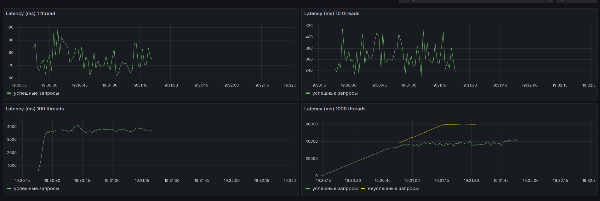
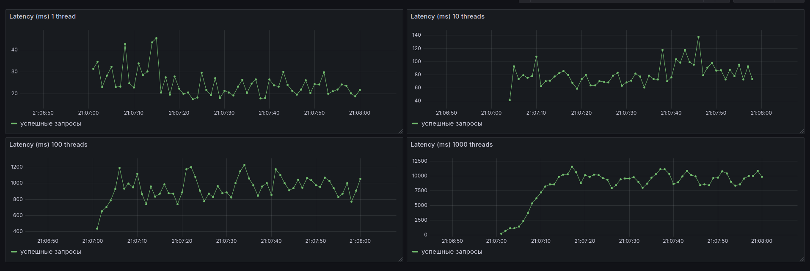
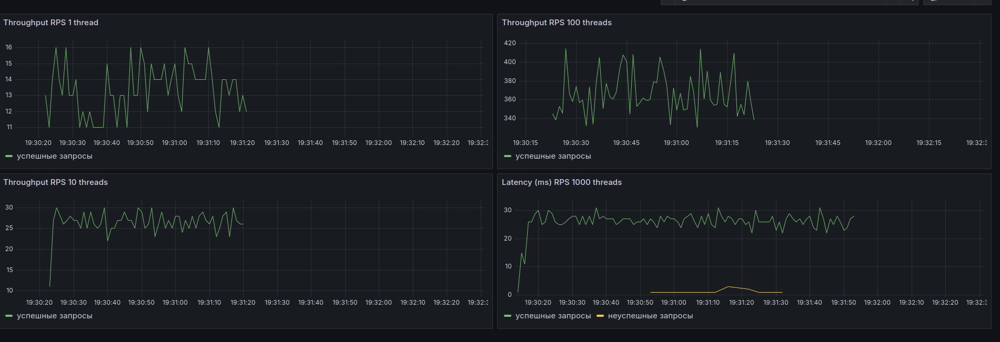
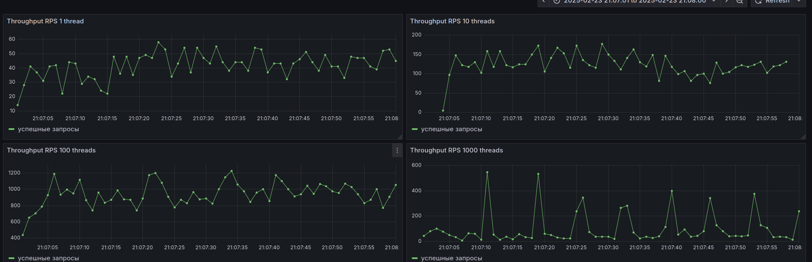
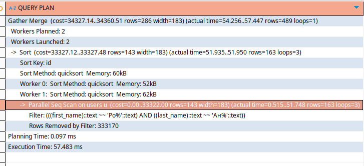
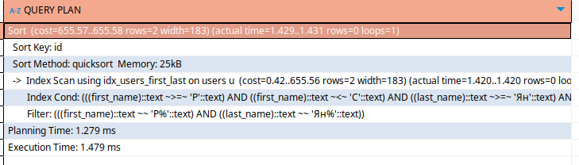

### Отчет о проведении нагрузочного тестирования оптимизации индексации поиска анкет

#### 1. Генерация данных

Выполнялся скрипт **generate_users.sh**, который запускал python-скрипт для формирования .csv файла с данными
для таблицы users. При этом для генерации имён/фамилий использовалась библиотека Faker. После этого основной баш-скрипт
копировал файл в docker-контейнер с БД и выполнял вставку миллиона записей

```sql
TRUNCATE TABLE users;
\COPY users (first_name, last_name, birthdate, city, biography, password, username) FROM '/users.csv' DELIMITER ',' CSV HEADER;
```

#### 2.1 Методология

- **Инструменты**: JMeter, InfluxDB2, Grafana
- **Количество одновременных запросов**: 1, 10, 100, 1000
- **Метрики**: Latency Throughput

В момент генерации запросов Jmeter был подключен JSR223 Sampler, определяющий случайным образом префиксы

```groovy
// Определяем списки значений
def firstNamePrefixes = ['Ро', 'А', 'Св', 'Т']
def lastNamePrefixes = ['Ник', 'Ив', 'Сер', 'Че']

// Генерируем случайные индексы для выбора значений из списков
def random = new Random()
def firstNameIndex = random.nextInt(firstNamePrefixes.size())
def lastNameIndex = random.nextInt(lastNamePrefixes.size())

// Установка переменных
vars.put('firstNamePrefix', firstNamePrefixes[firstNameIndex])
vars.put('lastNamePrefix', lastNamePrefixes[lastNameIndex])
```

#### 2.2 Latency до индекса



#### 2.3 Latency после индекса



#### 2.4 Throughput до индекса



#### 2.5 Throughput после индекса



#### 3 Оптимизация индекса


```sql
explain analyze 
SELECT * FROM users AS u 
WHERE u.first_name LIKE 'Ро%' AND u.last_name LIKE 'Ан%' 
ORDER BY u.id ASC
```

**План запроса до добавления индекса:**


Видно, что выполняется последовательное сканирование таблицы в параллельных потоках, при этом отфильтровывается более 333к строк, что не есть хорошо.
Это наше узкое место.

**План запроса после добавления индекса:**




Сейчас видно, что вместо последовательного сканирования таблицы происходит сканирование индекса и время выполнения запроса
сокращается с 57 мс до 2 мс, что очень хорошо. Индекс работает.

Индекс создавался следующим образом:
```sql
CREATE INDEX idx_users_first_last ON users (first_name text_pattern_ops, last_name text_pattern_ops)
```

Использование такого индекса обусловлено тем, что B-Tree улучшает производительность при поиске текстовых данных с использованием префиксных шаблонов.

#### 4. Выводы


В таблице ниже приведено сравнение производительности до и после добавления индекса. Сравниваются значения latency и throughput при нагрузочном тестировании.

| Параметр          | 1 поток   | 10 потоков | 100 потоков | 1000 потоков |
|-------------------|----------|------------|-------------|--------------|
| **Latency до**    | 80 ms    | 380 ms     | 4000 ms     | 40000 ms     |
| **Latency после** | 25 ms    | 80 ms      | 800 ms      | 8000 ms      |
| **Throughput до** | 13 req/s | 25 req/s   | 360 req/s   | 25 req/s     |
| **Throughput после** | 35 req/s | 125 req/s  | 900 req/s   | 40 req/s     |

Данные указывают на то, что добавление индекса значительно улучшает как время отклика системы, так и пропускную способность в целом.


